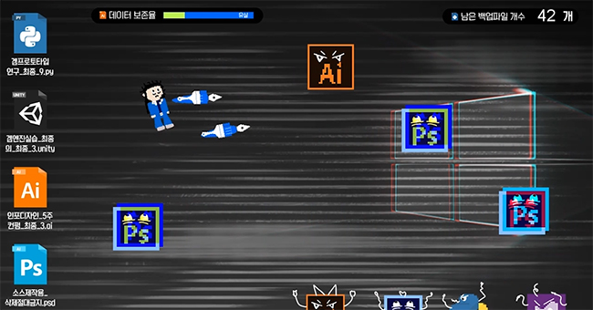

# Python Practice Archive
> 파이썬을 이용한 게임 제작 및 딥러닝 관련 작업입니다.  

## 설치 방법 (Installation Method)

파이썬을 다운 받은 뒤 작업(.py)을 실행하시면 됩니다.  
그 외 별도의 실행 방법이 필요할 경우 각 프로젝트에서 설명하고 있습니다.  
Pygame을 이용한 작업일 경우 Pygame을 추가적으로 다운받아야 합니다.  

## 업로드 내역 (Upload History)

* 190413
    * Upload : Computer_Dont_get_sick  
  
## 작품 목록 (List of works)
  
### Computer_Dont_get_sick  

  
구동되는 모습은 [Youtube](https://youtu.be/ob0pqhyWKew)에서 확인하실 수 있습니다.  
You can see it running on [Youtube](https://youtu.be/ob0pqhyWKew)  

## 정보 (Information)

정진균 (jin gyun, Jeong), JJIKKYU  
jjinggu96@gmail.com  
[https://jjikkyu.com](https://jjikkyu.com)  

